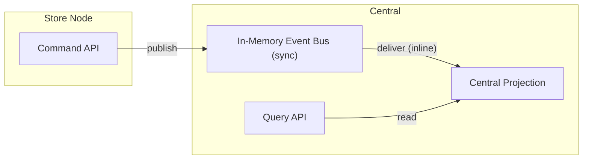
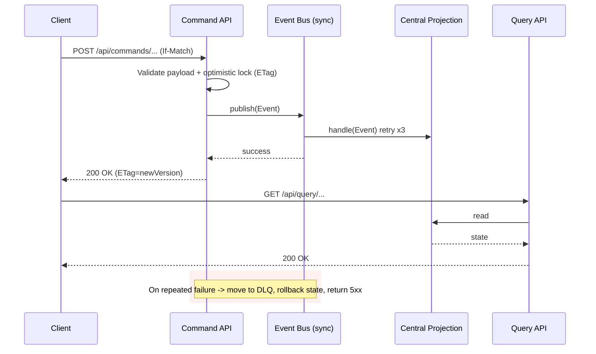

# inventory-management-system
inventory-management-system
## Distributed Inventory Management (Prototype)

This repository contains a simplified, production-inspired prototype for optimizing a distributed inventory management system using Java 21 and Spring Boot 3. It demonstrates event-driven consistency, low-latency writes, and a fast read model suitable for a chain of retail stores.

### Architecture

- **Store Command Service**: Accepts stock updates from stores and emits domain events (`StockReplaced`, `StockAdjusted`).
- **In-Memory Event Bus (sync)**: Delivers events in-process, synchronously, with bounded retries and DLQ em memória.
- **Central Query Projection**: Subscribes to events and maintains denormalized views for quick queries:
  - Total quantity by SKU across all stores
  - Per-store quantity by SKU

This follows CQRS + Event-Driven principles. In this variant we prioritize consistency-first: events are delivered synchronously in-process so reads reflect writes imediatamente. The central projection applies last-write-wins per partition (storeId|sku) via versioning.

### API

Commands

POST `/api/commands/inventory/replace`
```json
{ "storeId": "S1", "sku": "ABC-123", "quantity": 42 }
```

POST `/api/commands/inventory/adjust`
```json
{ "storeId": "S1", "sku": "ABC-123", "delta": -3 }
```

Optimistic locking (consistency): use `If-Match` com o valor da versão corrente (retornada no ETag das respostas de comando). Exemplo:

```bash
curl -i -X POST localhost:8080/api/commands/inventory/replace \
  -H 'Content-Type: application/json' \
  -H 'If-Match: "2"' \
  -d '{"storeId":"A","sku":"SKU1","quantity":10}'
```
Se a versão divergir, o servidor retorna `412 Precondition Failed` com a versão atual.

Queries

GET `/api/query/inventory/global/{sku}` -> `{ sku, quantity }`

GET `/api/query/inventory/store/{storeId}/{sku}` -> `{ storeId, sku, quantity }`

### Run locally

Prerequisites: Java 21, Maven 3.9+

```bash
mvn spring-boot:run
```

Open another terminal to try the flow (ETag na resposta indica a nova versão):

```bash
curl -s -X POST localhost:8080/api/commands/inventory/replace \
  -H 'Content-Type: application/json' \
  -d '{"storeId":"A","sku":"SKU1","quantity":10}'

curl -s -X POST localhost:8080/api/commands/inventory/adjust \
  -H 'Content-Type: application/json' \
  -d '{"storeId":"B","sku":"SKU1","delta":5}'

sleep 0.2

curl -s localhost:8080/api/query/inventory/global/SKU1 | jq
```

### Docker

Build and run with Docker:

```bash
docker build -t distributed-inventory:local .
docker run --rm -p 8080:8080 distributed-inventory:local
```

Or run with an OpenTelemetry Collector via Compose:

```bash
docker compose up --build
```

The app will export traces to the collector at `http://collector:4318/v1/traces` and the collector logs spans to stdout.

### Native image (GraalVM)

Build and run a native container:

```bash
docker build -f Dockerfile.native -t distributed-inventory:native .
docker run --rm -p 8080:8080 distributed-inventory:native
```

Notes:
- Uses `ghcr.io/graalvm/native-image:21` builder and `distroless` runtime.
- For local native build without Docker: `mvn -Pnative -DskipTests package` then run `target/distributed-inventory`.

### Observability

- Actuator endpoints enabled; Prometheus metrics available at `/actuator/prometheus`.
- OpenTelemetry via Micrometer Tracing:
  - HTTP spans for controllers annotated with `@Observed`
  - Custom spans for event bus publish/consume with context propagation across the async worker
  - OTLP HTTP export to `http://localhost:4318/v1/traces` (configurable via `OTEL_EXPORTER_OTLP_TRACES_ENDPOINT` or `management.otlp.tracing.endpoint`)

Metrics adicionais:
- `event_bus.publish.failures`
- `event_bus.consume.failures`

To see traces locally with an OTLP collector (e.g., `otel-collector` or Grafana Tempo):

```bash
docker run --rm -p 4318:4318 -e LOG_LEVEL=debug otel/opentelemetry-collector:0.106.0 \
  --config=
  'receivers: {otlp: {protocols: {http: {}}}} exporters: {logging: {}} service: {pipelines: {traces: {receivers: [otlp], exporters: [logging]}}}'
```

### Fault tolerance (prototype)

- Synchronous delivery with bounded retries (3 tentativas com backoff exponencial por assinante).
- Dead Letter Queue (em memória) caso não seja possível entregar o evento para um assinante — o comando falha e o estado é revertido.
- Idempotency and staleness handling via per `storeId|sku` version numbers; stale events are ignored.
- Last-write-wins per partition for simplicity; can be upgraded to vector clocks or CRDTs.

### Trade-offs and extensions

- In-memory bus and state are ephemeral; replace with Kafka and a persistent store for durability.
- Per-store snapshots are kept in memory to compute global totals. In production, use a compacted topic or a key-value store (Redis/RocksDB) for this map.
- Add inventory reservations, sagas for order flows, and reconciliation jobs.

### Tests

Run the integration test:

```bash
mvn -q -DskipTests=false test
```

### Performance

- Virtual threads enabled (`spring.threads.virtual.enabled=true`) to improve scalability for I/O‑bound requests.

### Load testing (k6)

`scripts/k6-inventory.js` runs a small scenario that mixes write and read traffic.

```bash
k6 run scripts/k6-inventory.js
```

### Diagram



### Sequence (consistency-first)



### Tech stack

- Java 21, Spring Boot 3.3
- Web + Actuator + Micrometer
